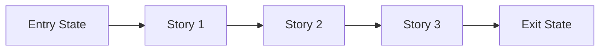

# Phase Contract: <Phase Name>

**Date**: <YYYY-MM-DD>
**Phase Slug**: <phase-slug>
**Whole Plan Reference**: `<optional path or summary>`
**Based on**:
- `history/<feature>/CONTEXT.md`
- `history/<feature>/discovery.md`
- `history/<feature>/approach.md`

---

## 1. Why This Phase Exists

> Explain in plain language why this phase is the next small loop to close.

`<2-4 sentences on why this phase matters now, not later.>`

---

## 2. Whole Plan Fit

### What Comes Before

- `<prior capability or assumption already in place>`

### What This Phase Contributes

- `<specific capability this phase adds to the larger plan>`

### What It Unlocks Next

- `<next phase or capability that becomes possible>`

---

## 3. Entry State

> What is true before this phase starts?

- `<observable truth 1>`
- `<observable truth 2>`
- `<constraint or dependency already satisfied>`

---

## 4. Exit State

> What must be true when this phase is complete?

- `<observable truth 1>`
- `<observable truth 2>`
- `<integration or system-level truth>`

**Rule:** every exit-state line must be testable or demonstrable.

---

## 5. Demo Story

> The simplest walkthrough that proves the phase is real.

`<In one short paragraph: "A user can now..." or "The system can now...">`

### Demo Checklist

- [ ] `<step 1>`
- [ ] `<step 2>`
- [ ] `<step 3>`

---

## 6. Story Outline

> Stories are the internal narrative slices inside the phase. They explain why
> the work order makes sense before beads are created.

| Story | Purpose | Why Now | Unlocks | Done Looks Like |
|-------|---------|---------|---------|-----------------|
| Story 1: `<name>` | `<purpose>` | `<why first>` | `<what it unlocks>` | `<observable done>` |
| Story 2: `<name>` | `<purpose>` | `<why next>` | `<what it unlocks>` | `<observable done>` |
| Story 3: `<name>` | `<purpose>` | `<why last>` | `<what it unlocks>` | `<observable done>` |

---

## 7. Phase Diagram

If the phase has fewer than 3 stories, remove the unused nodes and keep the
diagram aligned to the actual sequence.

---

## 8. Out Of Scope

- `<thing intentionally not solved here>`
- `<adjacent idea deferred to later>`

---

## 9. Success Signals

- `<how we know this phase genuinely worked>`
- `<what reviewers/UAT should specifically confirm>`

---

## 10. Failure / Pivot Signals

> If any of these happen, do not blindly continue the whole plan.

- `<signal that means the phase design is wrong>`
- `<signal that means the current approach should pivot>`
- `<signal that means the next phase should be reconsidered>`
